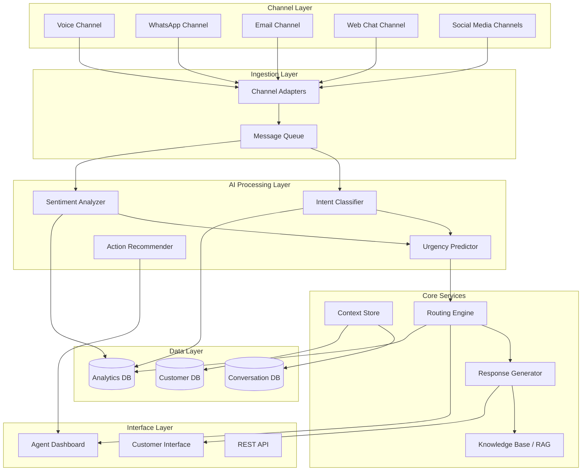

# Design Document: Omnichannel Customer Experience Platform

## Overview

The Omnichannel Customer Experience Platform is a cloud-native, AI-powered system that unifies customer interactions across multiple communication channels. The platform architecture follows a microservices pattern with event-driven communication, enabling horizontal scalability and fault isolation.

The system consists of several key subsystems:

- **Channel Adapters**: Normalize messages from different channels into a unified format
- **AI Processing Pipeline**: Analyzes messages for intent, sentiment, and urgency
- **Context Management**: Maintains unified conversation state across channels
- **Routing Engine**: Intelligently assigns conversations to agents or automation
- **Response Generation**: Creates personalized, context-aware responses
- **Agent Interface**: Provides unified timeline and action recommendations
- **Analytics Engine**: Tracks metrics and generates insights

The platform leverages Large Language Models (LLMs) for response generation, specialized ML models for intent classification and sentiment analysis, and a Retrieval-Augmented Generation (RAG) system for knowledge-based responses.

## Architecture

### High-Level Architecture



### Data Flow

1. **Message Ingestion**: Channel adapters receive messages, normalize format, extract metadata
2. **AI Analysis**: Messages flow through intent classification, sentiment analysis, and urgency prediction
3. **Routing Decision**: Routing engine determines automated response vs. human agent assignment
4. **Response Generation**: For automated responses, LLM generates personalized reply using RAG
5. **Agent Handling**: For human routing, agent receives conversation with context and recommendations
6. **Context Update**: All interactions update the unified conversation context
7. **Analytics**: All events feed into analytics pipeline for reporting and model improvement

### Technology Stack

- **Message Queue**: Apache Kafka for event streaming
- **Intent Classification**: Fine-tuned BERT model for multi-class classification
- **Sentiment Analysis**: Fine-tuned RoBERTa model for sentiment scoring
- **Response Generation**: GPT-4 or Claude for natural language generation
- **RAG System**: Vector database (Pinecone/Weaviate) + embedding model (text-embedding-3-large)
- **Routing Engine**: Custom rule engine + ML-based agent matching
- **Databases**: PostgreSQL for transactional data, MongoDB for conversation logs
- **Cache**: Redis for session state and real-time data
- **API Gateway**: Kong or AWS API Gateway
- **Container Orchestration**: Kubernetes

## Components and Interfaces

### 1. Channel Adapter Service

**Responsibility**: Normalize messages from different channels into unified format

**Interface**:

```typescript
interface ChannelAdapter {
  // Receive message from channel-specific webhook/API
  receiveMessage(channelMessage: ChannelSpecificMessage): Promise<void>;

  // Normalize to unified format
  normalizeMessage(channelMessage: ChannelSpecificMessage): UnifiedMessage;

  // Send response back to channel
  sendResponse(channelId: string, customerId: string, response: Response): Promise<void>;
}

interface UnifiedMessage {
  messageId: string;
  conversationId: string;
  customerId: string;
  channel: ChannelType;
  timestamp: Date;
  content: MessageContent;
  metadata: MessageMetadata;
}

interface MessageContent {
  text: string;
  attachments?: Attachment[];
  mediaUrls?: string[];
}

enum ChannelType {
  VOICE = 'voice',
  WHATSAPP = 'whatsapp',
  EMAIL = 'email',
  WEB_CHAT = 'web_chat',
  FACEBOOK = 'facebook',
  TWITTER = 'twitter',
  INSTAGRAM = 'instagram',
}
```

**Key Operations**:

- Authenticate with channel APIs
- Handle channel-specific message formats
- Extract customer identifiers
- Store multimedia content
- Publish normalized messages to message queue

### 2. Intent Classification Service

**Responsibility**: Identify customer intent and extract entities

**Interface**:

```typescript
interface IntentClassifier {
  // Classify message intent
  classifyIntent(message: UnifiedMessage): Promise<IntentResult>;

  // Extract entities from message
  extractEntities(message: UnifiedMessage): Promise<Entity[]>;
}

interface IntentResult {
  primaryIntent: Intent;
  secondaryIntents?: Intent[];
  confidence: number;
  requiresHumanReview: boolean;
}

interface Intent {
  category: IntentCategory;
  subcategory?: string;
  confidence: number;
}

enum IntentCategory {
  INQUIRY = 'inquiry',
  COMPLAINT = 'complaint',
  REQUEST = 'request',
  FEEDBACK = 'feedback',
  ESCALATION = 'escalation',
}

interface Entity {
  type: EntityType;
  value: string;
  confidence: number;
}

enum EntityType {
  PRODUCT = 'product',
  ORDER_NUMBER = 'order_number',
  DATE = 'date',
  AMOUNT = 'amount',
  PERSON = 'person',
  LOCATION = 'location',
}
```

**Model Details**:

- Base model: BERT-base fine-tuned on customer service conversations
- Training data: 500K+ labeled customer messages
- Confidence threshold: 70% for automated handling
- Entity extraction: Named Entity Recognition (NER) using spaCy + custom rules

### 3. Sentiment Analysis Service

**Responsibility**: Determine emotional tone and track sentiment trends

**Interface**:

```typescript
interface SentimentAnalyzer {
  // Analyze message sentiment
  analyzeSentiment(message: UnifiedMessage): Promise<SentimentResult>;

  // Get sentiment trend for conversation
  getSentimentTrend(conversationId: string): Promise<SentimentTrend>;
}

interface SentimentResult {
  score: number; // -1.0 to +1.0
  label: SentimentLabel;
  confidence: number;
  emotionalIndicators: string[];
}

enum SentimentLabel {
  VERY_NEGATIVE = 'very_negative',
  NEGATIVE = 'negative',
  NEUTRAL = 'neutral',
  POSITIVE = 'positive',
  VERY_POSITIVE = 'very_positive',
}

interface SentimentTrend {
  conversationId: string;
  sentimentHistory: SentimentPoint[];
  overallTrend: 'improving' | 'declining' | 'stable';
  deteriorationDetected: boolean;
}

interface SentimentPoint {
  timestamp: Date;
  score: number;
  messageId: string;
}
```

**Model Details**:

- Base model: RoBERTa fine-tuned for sentiment analysis
- Output: Continuous score from -1.0 (very negative) to +1.0 (very positive)
- Sentiment labels mapped from score ranges
- Trend detection: Sliding window analysis over conversation history

### 4. Context Store Service

**Responsibility**: Maintain unified conversation state and customer profiles

**Interface**:

```typescript
interface ContextStore {
  // Get or create conversation
  getConversation(conversationId: string): Promise<Conversation>;
  createConversation(customerId: string, channel: ChannelType): Promise<Conversation>;

  // Update conversation
  addMessage(conversationId: string, message: UnifiedMessage): Promise<void>;
  updateConversationState(conversationId: string, state: ConversationState): Promise<void>;

  // Link conversations across channels
  linkConversations(customerId: string, newConversationId: string): Promise<void>;

  // Get customer profile
  getCustomerProfile(customerId: string): Promise<CustomerProfile>;
  updateCustomerProfile(customerId: string, updates: Partial<CustomerProfile>): Promise<void>;

  // Archive inactive conversations
  archiveConversation(conversationId: string): Promise<void>;
}

interface Conversation {
  conversationId: string;
  customerId: string;
  channels: ChannelType[];
  messages: ConversationMessage[];
  state: ConversationState;
  metadata: ConversationMetadata;
  createdAt: Date;
  lastActivityAt: Date;
}

interface ConversationMessage {
  messageId: string;
  channel: ChannelType;
  direction: 'inbound' | 'outbound';
  content: MessageContent;
  intent?: IntentResult;
  sentiment?: SentimentResult;
  timestamp: Date;
  handledBy?: 'automation' | 'agent';
  agentId?: string;
}

interface ConversationState {
  status: 'active' | 'waiting' | 'resolved' | 'archived';
  assignedAgentId?: string;
  urgencyScore: number;
  escalated: boolean;
  automationAttempts: number;
}

interface CustomerProfile {
  customerId: string;
  name: string;
  email?: string;
  phone?: string;
  preferredChannel?: ChannelType;
  customerValue: 'low' | 'medium' | 'high' | 'vip';
  purchaseHistory: Purchase[];
  previousIssues: Issue[];
  preferences: Record<string, any>;
  createdAt: Date;
}
```

**Storage Strategy**:

- Active conversations: Redis cache for fast access
- Conversation history: MongoDB for flexible schema
- Customer profiles: PostgreSQL for relational queries
- Archive: S3/Cloud Storage for long-term retention

### 5. Urgency Predictor Service

**Responsibility**: Calculate priority score for conversations

**Interface**:

```typescript
interface UrgencyPredictor {
  // Calculate urgency score
  predictUrgency(context: UrgencyContext): Promise<UrgencyScore>;

  // Update urgency based on new events
  updateUrgency(conversationId: string, event: ConversationEvent): Promise<UrgencyScore>;
}

interface UrgencyContext {
  conversation: Conversation;
  intent: IntentResult;
  sentiment: SentimentResult;
  customerProfile: CustomerProfile;
}

interface UrgencyScore {
  score: number; // 1-10
  factors: UrgencyFactor[];
  reasoning: string;
}

interface UrgencyFactor {
  factor: string;
  contribution: number;
  description: string;
}
```

**Scoring Algorithm**:

```
Base Score = 5

Sentiment Adjustment:
  - score < -0.5: +2
  - score < -0.3: +1
  - score > 0.5: -1

Intent Adjustment:
  - ESCALATION: +3
  - COMPLAINT: +2
  - REQUEST: +1
  - INQUIRY: 0
  - FEEDBACK: 0

Customer Value Adjustment:
  - VIP: +2
  - High: +1
  - Medium: 0
  - Low: 0

Repeat Contact Adjustment:
  - Same issue within 7 days: +2
  - Same issue within 30 days: +1

Time Sensitivity:
  - Keywords (urgent, asap, immediately): +2
  - Business hours: 0
  - After hours: +1

Final Score = clamp(Base + Adjustments, 1, 10)
```

### 6. Routing Engine Service

**Responsibility**: Assign conversations to agents or automation

**Interface**:

```typescript
interface RoutingEngine {
  // Route new conversation
  routeConversation(conversation: Conversation, urgency: UrgencyScore): Promise<RoutingDecision>;

  // Find best agent for assignment
  findBestAgent(requirements: AgentRequirements): Promise<Agent | null>;

  // Queue conversation if no agents available
  queueConversation(conversationId: string, urgency: UrgencyScore): Promise<void>;

  // Get queue status
  getQueueStatus(): Promise<QueueStatus>;
}

interface RoutingDecision {
  decision: 'automate' | 'assign_agent' | 'queue';
  agentId?: string;
  estimatedWaitTime?: number;
  reasoning: string;
}

interface AgentRequirements {
  skills: string[];
  language: string;
  urgency: number;
  preferredAgentId?: string;
}

interface Agent {
  agentId: string;
  name: string;
  skills: string[];
  languages: string[];
  currentWorkload: number;
  maxWorkload: number;
  status: 'available' | 'busy' | 'offline';
  performanceScore: number;
}

interface QueueStatus {
  totalQueued: number;
  averageWaitTime: number;
  queuedByUrgency: Record<number, number>;
}
```

**Routing Logic**:

1. Check if automation is appropriate (intent confidence > 85%, urgency < 8)
2. If human needed, find best available agent:
   - Match required skills
   - Check language capability
   - Consider current workload (max 5 conversations)
   - Prefer agent with customer history
   - Weight by performance score
3. If no agents available, queue by urgency score
4. Notify customer of wait time

### 7. Response Generator Service

**Responsibility**: Generate personalized automated responses

**Interface**:

```typescript
interface ResponseGenerator {
  // Generate automated response
  generateResponse(context: ResponseContext): Promise<GeneratedResponse>;

  // Validate response safety
  validateResponse(response: string): Promise<ValidationResult>;
}

interface ResponseContext {
  conversation: Conversation;
  customerProfile: CustomerProfile;
  intent: IntentResult;
  sentiment: SentimentResult;
  knowledgeBaseResults: KnowledgeResult[];
}

interface GeneratedResponse {
  text: string;
  confidence: number;
  sources: string[];
  suggestedActions: Action[];
  requiresHumanReview: boolean;
}

interface ValidationResult {
  isValid: boolean;
  violations: PolicyViolation[];
  containsPII: boolean;
}

interface PolicyViolation {
  type: string;
  severity: 'low' | 'medium' | 'high';
  description: string;
}
```

**LLM Integration**:

- Model: GPT-4 or Claude 3
- System prompt includes:
  - Brand voice guidelines
  - Safety constraints
  - Personalization instructions
  - Response format requirements
- RAG integration:
  - Query knowledge base with customer question
  - Retrieve top 5 relevant documents
  - Include in LLM context
  - Cite sources in response
- Safety checks:
  - No PII from other customers
  - No policy violations
  - No harmful content
  - Confidence threshold: 80%

### 8. Action Recommender Service

**Responsibility**: Suggest next best actions to agents

**Interface**:

```typescript
interface ActionRecommender {
  // Get action recommendations
  getRecommendations(context: ActionContext): Promise<ActionRecommendation[]>;

  // Record action outcome for learning
  recordOutcome(actionId: string, outcome: ActionOutcome): Promise<void>;
}

interface ActionContext {
  conversation: Conversation;
  customerProfile: CustomerProfile;
  intent: IntentResult;
  sentiment: SentimentResult;
}

interface ActionRecommendation {
  actionId: string;
  type: ActionType;
  description: string;
  confidence: number;
  expectedOutcome: string;
  parameters: Record<string, any>;
}

enum ActionType {
  SEND_RESPONSE = 'send_response',
  ISSUE_REFUND = 'issue_refund',
  ESCALATE = 'escalate',
  SCHEDULE_FOLLOWUP = 'schedule_followup',
  UPDATE_ORDER = 'update_order',
  SEND_DOCUMENTATION = 'send_documentation',
}

interface ActionOutcome {
  actionId: string;
  success: boolean;
  customerSatisfaction?: number;
  resolutionTime?: number;
  notes?: string;
}
```

**Recommendation Algorithm**:

- Analyze successful resolution patterns from historical data
- Match current context to similar past conversations
- Rank actions by success probability
- Return top 3 recommendations with confidence scores
- Continuously learn from agent feedback

## Data Models

### Core Data Structures

```typescript
// Message Queue Event
interface MessageEvent {
  eventId: string;
  eventType: 'message_received' | 'message_sent' | 'escalation' | 'resolution';
  timestamp: Date;
  conversationId: string;
  payload: any;
}

// Analytics Event
interface AnalyticsEvent {
  eventId: string;
  eventType: string;
  timestamp: Date;
  conversationId: string;
  customerId: string;
  metrics: Record<string, number>;
  dimensions: Record<string, string>;
}

// Knowledge Base Document
interface KnowledgeDocument {
  documentId: string;
  title: string;
  content: string;
  category: string;
  tags: string[];
  embedding: number[];
  lastUpdated: Date;
}

// Agent Performance Metrics
interface AgentMetrics {
  agentId: string;
  period: DateRange;
  conversationsHandled: number;
  averageResponseTime: number;
  averageResolutionTime: number;
  customerSatisfactionScore: number;
  escalationRate: number;
}
```

### Database Schemas

**PostgreSQL - Customer Profiles**:

```sql
CREATE TABLE customers (
  customer_id UUID PRIMARY KEY,
  name VARCHAR(255),
  email VARCHAR(255),
  phone VARCHAR(50),
  preferred_channel VARCHAR(50),
  customer_value VARCHAR(20),
  created_at TIMESTAMP,
  updated_at TIMESTAMP
);

CREATE TABLE purchases (
  purchase_id UUID PRIMARY KEY,
  customer_id UUID REFERENCES customers(customer_id),
  product_id VARCHAR(100),
  amount DECIMAL(10,2),
  purchase_date TIMESTAMP
);

CREATE TABLE issues (
  issue_id UUID PRIMARY KEY,
  customer_id UUID REFERENCES customers(customer_id),
  issue_type VARCHAR(100),
  resolution_status VARCHAR(50),
  created_at TIMESTAMP,
  resolved_at TIMESTAMP
);
```

**MongoDB - Conversations**:

```javascript
{
  _id: ObjectId,
  conversationId: String,
  customerId: String,
  channels: [String],
  messages: [{
    messageId: String,
    channel: String,
    direction: String,
    content: {
      text: String,
      attachments: [Object]
    },
    intent: Object,
    sentiment: Object,
    timestamp: Date,
    handledBy: String,
    agentId: String
  }],
  state: {
    status: String,
    assignedAgentId: String,
    urgencyScore: Number,
    escalated: Boolean,
    automationAttempts: Number
  },
  metadata: Object,
  createdAt: Date,
  lastActivityAt: Date
}
```

## Correctness Properties

_A property is a characteristic or behavior that should hold true across all valid executions of a system—essentially, a formal statement about what the system should do. Properties serve as the bridge between human-readable specifications and machine-verifiable correctness guarantees._

### Property Reflection

After analyzing all acceptance criteria, I've identified several areas where properties can be consolidated:

- Message normalization properties (1.1, 1.2, 1.3) can be combined into comprehensive format validation
- Intent classification properties (2.1, 2.2) overlap and can be unified
- Sentiment analysis properties (3.1, 3.2) can be combined into range validation
- Timeline display properties (9.1, 9.2) can be unified into complete data structure validation
- Several properties about "all messages" or "all conversations" follow similar patterns and can use shared validation logic

### Core Properties

**Property 1: Message Normalization Completeness**
_For any_ message from any supported channel, normalizing the message SHALL produce a UnifiedMessage containing all required fields (messageId, conversationId, customerId, channel, timestamp, content) and preserve all original content including multimedia references.
**Validates: Requirements 1.1, 1.2, 1.3**

**Property 2: Retry with Exponential Backoff**
_For any_ message ingestion failure, the system SHALL retry with exponentially increasing delays (2^n seconds where n is attempt number) and log each failure.
**Validates: Requirements 1.4**

**Property 3: Intent Classification Validity**
_For any_ customer message, the Intent_Classifier SHALL return a result with a primary intent from valid categories (inquiry, complaint, request, feedback, escalation) and a confidence score between 0 and 1.
**Validates: Requirements 2.1, 2.2**

**Property 4: Low Confidence Flagging**
_For any_ intent classification with confidence below 0.70, the result SHALL be flagged for human review.
**Validates: Requirements 2.3**

**Property 5: Entity Extraction Presence**
_For any_ message containing recognizable entities (product names, order numbers, dates, amounts), the Intent_Classifier SHALL extract and return those entities with type labels and confidence scores.
**Validates: Requirements 2.4**

**Property 6: Multi-Intent Ranking**
_For any_ message with multiple detected intents, all intents SHALL be returned in descending order of relevance score.
**Validates: Requirements 2.5**

**Property 7: Sentiment Score Range**
_For any_ customer message, the Sentiment_Analyzer SHALL return a score within the range [-1.0, +1.0] and a corresponding label (very_negative, negative, neutral, positive, very_positive).
**Validates: Requirements 3.1, 3.2**

**Property 8: Negative Sentiment Urgency Boost**
_For any_ message with sentiment score below -0.5, the urgency score SHALL be increased compared to the base calculation.
**Validates: Requirements 3.3**

**Property 9: Sentiment History Tracking**
_For any_ conversation, all sentiment scores SHALL be recorded with timestamps, enabling trend analysis over the conversation lifetime.
**Validates: Requirements 3.4**

**Property 10: Sentiment Deterioration Detection**
_For any_ conversation where sentiment drops by more than 0.3 points between consecutive messages, the system SHALL flag deterioration and trigger escalation consideration.
**Validates: Requirements 3.5**

**Property 11: Cross-Channel Conversation Linking**
_For any_ customer who sends messages on different channels, all messages SHALL be linked to a unified conversation thread associated with that customer.
**Validates: Requirements 4.1, 4.2**

**Property 12: Chronological Message Ordering**
_For any_ conversation, when retrieving the message history, all messages SHALL be ordered by timestamp (ascending) and include channel indicators.
**Validates: Requirements 4.3**

**Property 13: Customer Profile Persistence**
_For any_ customer profile update (preferences, purchase history, previous issues), the data SHALL be stored and retrievable in subsequent queries.
**Validates: Requirements 4.4**

**Property 14: Conversation Archival**
_For any_ conversation with no activity for 24 hours, the conversation SHALL be marked as archived but remain retrievable through queries.
**Validates: Requirements 4.5**

**Property 15: Urgency Score Range**
_For any_ new message, the Urgency_Predictor SHALL calculate a score within the range [1, 10] (inclusive).
**Validates: Requirements 5.1**

**Property 16: Multi-Factor Urgency Calculation**
_For any_ two messages that differ in sentiment, intent, customer value, or time sensitivity, if all other factors are equal, the urgency scores SHALL differ, demonstrating that each factor influences the calculation.
**Validates: Requirements 5.2**

**Property 17: High Urgency Agent Routing**
_For any_ conversation with urgency score exceeding 8, the routing decision SHALL be "assign_agent" or "queue" (never "automate").
**Validates: Requirements 5.3**

**Property 18: Repeat Contact Urgency Increase**
_For any_ customer who contacts about the same issue multiple times within 7 days, the urgency score SHALL be higher than the first contact about that issue.
**Validates: Requirements 5.4**

**Property 19: VIP Customer Urgency Boost**
_For any_ customer with customerValue = "vip", the urgency score SHALL be at least 2 points higher than an identical message from a non-VIP customer.
**Validates: Requirements 5.5**

**Property 20: Agent Skill Matching**
_For any_ conversation requiring specific skills, the assigned agent SHALL possess all required skills from their skill set.
**Validates: Requirements 6.1, 6.2**

**Property 21: Queue Ordering by Urgency**
_For any_ set of queued conversations when no agents are available, conversations SHALL be ordered by urgency score (descending), with highest urgency first.
**Validates: Requirements 6.3**

**Property 22: Agent Workload Limit**
_For any_ agent with 5 or more active conversations, the Routing_Engine SHALL not assign additional conversations to that agent.
**Validates: Requirements 6.4**

**Property 23: Agent Continuity Preference**
_For any_ returning customer who previously interacted with a specific agent, if that agent is available and under workload limit, the conversation SHALL be routed to that agent.
**Validates: Requirements 6.5**

**Property 24: High Confidence Automation**
_For any_ message with intent confidence exceeding 0.85 and matching a known automation pattern, the routing decision SHALL be "automate".
**Validates: Requirements 7.1**

**Property 25: Response Personalization**
_For any_ automated response generated for a customer, the response SHALL include the customer's name and reference relevant information from their profile or conversation history.
**Validates: Requirements 7.2**

**Property 26: Knowledge Base Integration**
_For any_ automated response, if relevant knowledge base documents exist for the intent, the response SHALL incorporate information from those documents and cite sources.
**Validates: Requirements 7.3**

**Property 27: Response Actionability**
_For any_ automated response, the response SHALL include at least one actionable element (link, document reference, or next step instruction).
**Validates: Requirements 7.5**

**Property 28: Action Recommendation Limit**
_For any_ conversation, the Action_Recommender SHALL return at most 3 action recommendations.
**Validates: Requirements 8.1**

**Property 29: Context-Aware Recommendations**
_For any_ two conversations with different intents or sentiments, the recommended actions SHALL differ, demonstrating context-awareness.
**Validates: Requirements 8.2**

**Property 30: Recommendation Confidence Scores**
_For any_ action recommendation, the recommendation SHALL include a confidence score between 0 and 1.
**Validates: Requirements 8.3**

**Property 31: Action Outcome Tracking**
_For any_ action selected by an agent, the system SHALL log the action ID, outcome, and timestamp for learning purposes.
**Validates: Requirements 8.4**

**Property 32: Proactive Action Suggestions**
_For any_ conversation with negative sentiment and complaint intent, the Action_Recommender SHALL include at least one proactive action (refund, escalation, or follow-up) in the recommendations.
**Validates: Requirements 8.5**

**Property 33: Unified Timeline Completeness**
_For any_ conversation, the Unified_Timeline data structure SHALL contain all messages from all channels with complete information (content, channel, timestamp, sentiment, intent).
**Validates: Requirements 9.1, 9.2**

**Property 34: Customer Profile Availability**
_For any_ conversation view request, the response SHALL include customer profile data (contact details, purchase history, previous issues).
**Validates: Requirements 9.3**

**Property 35: Key Event Highlighting**
_For any_ conversation containing escalations, significant sentiment changes (>0.3 point drops), or resolutions, these events SHALL be marked with a highlight flag in the timeline data.
**Validates: Requirements 9.5**

**Property 36: Explicit Escalation Request**
_For any_ message containing escalation keywords ("speak to human", "talk to agent", "escalate"), the system SHALL immediately route to the Routing_Engine with escalation flag set.
**Validates: Requirements 10.1**

**Property 37: Automatic Escalation Threshold**
_For any_ conversation where automated responses have been sent 3 times without resolution, the next routing decision SHALL be escalation to human agent.
**Validates: Requirements 10.2**

**Property 38: Escalation Context Transfer**
_For any_ escalation, the complete conversation context (all messages, customer profile, intent, sentiment) SHALL be transferred to the assigned agent.
**Validates: Requirements 10.3**

**Property 39: Wait Time Notification**
_For any_ escalation when agents are not immediately available, the customer notification SHALL include an estimated wait time.
**Validates: Requirements 10.4**

**Property 40: Response Safety Validation**
_For any_ automated response generated, the response SHALL pass through safety validation before being sent to customers.
**Validates: Requirements 11.1**

**Property 41: PII Protection**
_For any_ automated response, the response SHALL not contain personal identifiable information (email, phone, address) of any customer other than the recipient.
**Validates: Requirements 11.2**

**Property 42: Policy Violation Blocking**
_For any_ generated response that fails safety validation due to policy violations, the response SHALL be blocked and the conversation SHALL be escalated to human review.
**Validates: Requirements 11.3**

**Property 43: Response Audit Logging**
_For any_ automated response sent to a customer, the complete response text, timestamp, and conversation ID SHALL be logged for audit purposes.
**Validates: Requirements 11.4**

**Property 44: Low Confidence Escalation**
_For any_ response generation with confidence below 0.80, the system SHALL escalate to human agents instead of sending the automated response.
**Validates: Requirements 11.5**

**Property 45: Queue Urgency Ordering**
_For any_ message queue exceeding capacity, messages SHALL be processed in descending order of urgency score.
**Validates: Requirements 12.2**

**Property 46: Metrics Collection**
_For any_ conversation event (message received, response sent, escalation, resolution), the system SHALL record metrics including response time, resolution status, and channel.
**Validates: Requirements 13.1**

**Property 47: Daily Report Generation**
_For any_ 24-hour period, the system SHALL generate a report containing conversation volume, sentiment trends, and agent performance metrics.
**Validates: Requirements 13.2**

**Property 48: Cost Savings Calculation**
_For any_ automated resolution, the system SHALL calculate cost savings as (average_agent_cost_per_conversation - automation_cost_per_conversation) and include in analytics.
**Validates: Requirements 13.3**

**Property 49: Trending Topic Identification**
_For any_ set of conversations within a time window, the system SHALL identify and rank common issues by frequency of occurrence.
**Validates: Requirements 13.4**

**Property 50: Real-Time Dashboard Data**
_For any_ dashboard query, the response SHALL include current counts of active conversations, queue depth, and available agents.
**Validates: Requirements 13.5**

**Property 51: API Authentication**
_For any_ REST API request, the request SHALL be authenticated using either OAuth 2.0 token or valid API key before processing.
**Validates: Requirements 14.3**

**Property 52: Webhook Event Delivery**
_For any_ configured webhook and matching event (message received, escalation, resolution), the system SHALL send an HTTP POST request to the webhook URL with event data.
**Validates: Requirements 14.2**

**Property 53: Custom Configuration Application**
_For any_ custom intent category, response template, routing rule, or escalation trigger configured, the system SHALL apply that configuration in subsequent processing.
**Validates: Requirements 14.4, 14.5**

**Property 54: Data Encryption at Rest**
_For any_ customer data stored in the database, the data SHALL be encrypted using AES-256 encryption.
**Validates: Requirements 15.1**

**Property 55: Role-Based Access Control**
_For any_ user attempting to access conversation data or perform administrative actions, the system SHALL verify the user has the required role permissions before allowing access.
**Validates: Requirements 15.3**

**Property 56: Retention Policy Application**
_For any_ conversation older than the configured retention period, the conversation SHALL be deleted or archived according to the retention policy.
**Validates: Requirements 15.4**

**Property 57: Data Deletion with Anonymization**
_For any_ customer data deletion request, all personal identifiable information SHALL be removed within 30 days, while anonymized conversation data (with PII removed) SHALL be retained for analytics.
**Validates: Requirements 15.5**

## Error Handling

### Error Categories

1. **Channel Communication Errors**
   - Channel API unavailable
   - Message delivery failure
   - Authentication failure with channel
   - **Handling**: Retry with exponential backoff (max 5 attempts), log error, alert operations team

2. **AI Model Errors**
   - Model inference timeout
   - Model returns invalid output
   - Model service unavailable
   - **Handling**: Fall back to rule-based classification, escalate to human agent, log for model team review

3. **Data Store Errors**
   - Database connection failure
   - Query timeout
   - Data corruption
   - **Handling**: Retry with circuit breaker pattern, use cached data if available, escalate to human agent

4. **Integration Errors**
   - External API timeout
   - Invalid API response
   - Authentication failure
   - **Handling**: Retry with backoff, use fallback data sources, notify customer of delay

5. **Validation Errors**
   - Invalid message format
   - Missing required fields
   - Policy violation detected
   - **Handling**: Return error to sender, log for investigation, escalate if customer-facing

### Error Recovery Strategies

**Circuit Breaker Pattern**:

- Track failure rate for each external dependency
- Open circuit after 5 consecutive failures
- Half-open after 30 seconds to test recovery
- Close circuit after 3 successful requests

**Graceful Degradation**:

- If AI models unavailable, use rule-based fallbacks
- If knowledge base unavailable, use cached responses
- If routing engine unavailable, queue all conversations
- Always prioritize customer communication over perfect responses

**Dead Letter Queue**:

- Messages that fail processing after max retries go to DLQ
- Operations team reviews DLQ daily
- Failed messages can be replayed after fixes

## Testing Strategy

### Dual Testing Approach

The platform requires both unit testing and property-based testing for comprehensive coverage:

**Unit Tests**: Focus on specific examples, edge cases, and error conditions

- Test specific message formats from each channel
- Test error handling paths
- Test integration points between services
- Test specific customer scenarios
- Validate API contracts

**Property-Based Tests**: Verify universal properties across all inputs

- Test that properties hold for randomly generated messages
- Test that invariants are maintained across operations
- Test that system behavior is consistent across all valid inputs
- Minimum 100 iterations per property test

Both approaches are complementary and necessary. Unit tests catch concrete bugs in specific scenarios, while property tests verify general correctness across the input space.

### Property-Based Testing Configuration

**Framework Selection**:

- **Python**: Use Hypothesis library
- **TypeScript/JavaScript**: Use fast-check library
- **Java**: Use jqwik library
- **Go**: Use gopter library

**Test Configuration**:

- Minimum 100 iterations per property test
- Each test must reference its design document property
- Tag format: `Feature: omnichannel-cx-platform, Property {number}: {property_text}`

**Example Property Test Structure** (Python with Hypothesis):

```python
from hypothesis import given, strategies as st
import pytest

@given(
    channel=st.sampled_from(['voice', 'whatsapp', 'email', 'web_chat', 'facebook']),
    message_text=st.text(min_size=1, max_size=1000),
    customer_id=st.uuids()
)
def test_message_normalization_completeness(channel, message_text, customer_id):
    """
    Feature: omnichannel-cx-platform, Property 1: Message Normalization Completeness
    For any message from any supported channel, normalizing the message SHALL produce
    a UnifiedMessage containing all required fields.
    """
    # Arrange
    channel_message = create_channel_message(channel, message_text, customer_id)
    adapter = get_channel_adapter(channel)

    # Act
    unified_message = adapter.normalize_message(channel_message)

    # Assert
    assert unified_message.message_id is not None
    assert unified_message.conversation_id is not None
    assert unified_message.customer_id == str(customer_id)
    assert unified_message.channel == channel
    assert unified_message.timestamp is not None
    assert unified_message.content.text == message_text
```

### Testing Layers

**1. Unit Tests**

- Test individual functions and methods
- Mock external dependencies
- Fast execution (< 1 second per test)
- High code coverage target (>80%)

**2. Property-Based Tests**

- Test universal properties with generated inputs
- Run minimum 100 iterations per property
- Catch edge cases that unit tests miss
- Validate invariants and contracts

**3. Integration Tests**

- Test service-to-service communication
- Use test doubles for external APIs
- Validate end-to-end flows
- Test error handling and retries

**4. Contract Tests**

- Validate API contracts between services
- Use tools like Pact for consumer-driven contracts
- Ensure backward compatibility

**5. Load Tests**

- Validate performance requirements
- Test auto-scaling behavior
- Identify bottlenecks
- Use tools like k6 or Gatling

### Test Data Strategy

**Synthetic Data Generation**:

- Generate realistic customer messages using LLMs
- Create diverse conversation scenarios
- Include edge cases (very long messages, special characters, multiple languages)
- Generate customer profiles with varied attributes

**Anonymized Production Data**:

- Use anonymized real conversations for testing
- Remove all PII before use in tests
- Maintain realistic distribution of intents and sentiments
- Update test data regularly

### Continuous Testing

**CI/CD Pipeline**:

1. Unit tests run on every commit
2. Property-based tests run on every PR
3. Integration tests run on merge to main
4. Load tests run nightly
5. Security scans run weekly

**Test Metrics**:

- Code coverage (target: >80%)
- Property test pass rate
- Integration test pass rate
- Mean time to detect failures
- Mean time to repair

### Safety and Accuracy Testing

**AI Model Validation**:

- Test intent classifier accuracy on held-out test set (target: >90%)
- Test sentiment analyzer accuracy (target: >85%)
- Test for bias in routing decisions
- Validate response quality with human evaluation

**Safety Testing**:

- Test for PII leakage in responses
- Test for policy violations
- Test for harmful content generation
- Red team testing for adversarial inputs

**A/B Testing**:

- Test new models against production models
- Measure impact on customer satisfaction
- Gradual rollout of model updates
- Rollback capability for failed experiments
